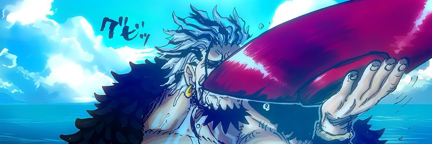

<h1 align="center">🏴‍☠️ Ram Bhosale</h1>

  <b>Mechanical Engineering Student</b> · Full-stack apps & real-time systems 
  Motorsport · CAD · Vehicle engineering

<i>"Inherited Will, The Destiny of the Era, The Dreams of People."</i>

---

## ⚓ About Me

- 🔧 Mechanical engineering student who loves building things, in metal and in code
- 💻 Building full-stack applications and real-time systems
- 🏎️ Passionate about motorsport engineering, CAD, and vehicle design
- 🌱 Currently working on **DocYard**, a document management platform

---

## 🧭 Tech Stack

  
  
  
  
  
  
  
  
  

---

## 🗺️ Projects

| Project | Description | Stack |
|---------|-------------|-------|
| [**DocYard**](https://github.com/I-am-ram09/Docyard) | Document management website with multilingual support and cloud storage | React, Vite, Express |

*More projects coming soon, the voyage has just begun.* 🌊

---

## 📊 GitHub Stats

  
  

---

## 📫 Find Me

  
  

  

